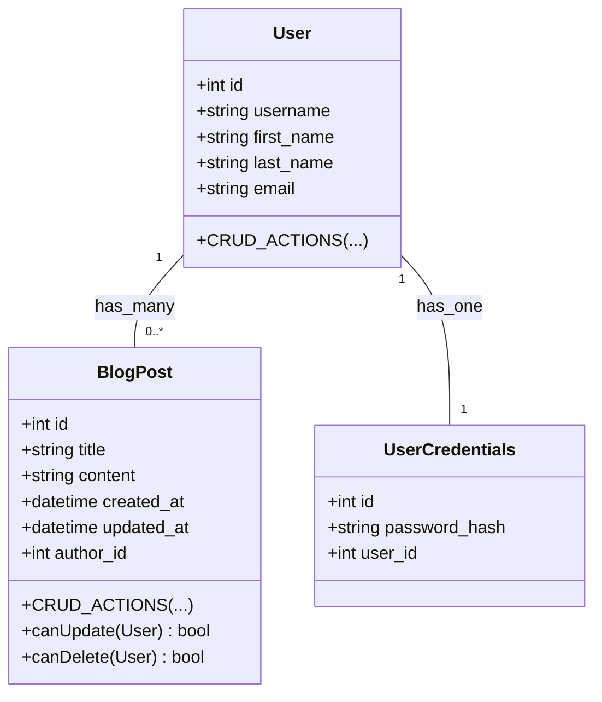

# About this project

[Frontend Documentation](./frontend/README.md)

## Running the App

| Link Description                          | URL                                                |
|-------------------------------------------|----------------------------------------------------|
| GitHub Repository                          | [Repository](https://github.com/TheBranchDriftCatalyst/microblog/tree/master) |
| Microblog Frontend                         | [Frontend](http://localhost:5100/)   |
| API Documentation                          | [Swagger Ninja](http://localhost:8000/api/docs#/) |
| Admin Dashboard                            | [Django Admin](http://localhost:8000/admin/) |
| Storybook Component Documentation          | [Storybook](http://localhost:6006/) |

### Easy all in one dev command

> Ports are not harcoded but are required for CORs. Everyone should auto start 
> on the same port  but i would like eventually TODO: hardcode these port mappings for better devX

```sh
foreman start
```

### Starting the Backend

**Backend**

```sh

# If you have issues with task file the relevant commands can 
# be run manually (see task file for task commands)

# ensure taskfile is installed
brew install go-task # (for mac)
poetry install
poetry shell
# Start PG database
docker compose up -d
task migrate
task seed

# User admin created by the seed command
# email = panda@gmail.com
# password = turbopookipanda

# Start the dev server
task dev 

```

### Starting the Frontend
  
```sh
cd frontend/

yarn install

task dev:next # ie/. yarn dev:next 
yarn storybook

```

## Building The App

> TODO: build commands no currently enabled, must do final pass for all linting checks for this as well

## Database



---

## Process Steps

### Design Decisions

**Why two project folders? (backend, frontend)**

I struggled with the question of wheather i wanted django to serve the app or not.  Having dealt with issues having ruby serve a react app, i decided NOT to have django serve the spa.  Theoretically this is somewaht moot at this point as next can output a static site and we can have that served by django.  I also much rather prefer working on the frontend isolated from any secondary SSR frameworks.

**Auth and Handling Users**

Slightly due to the above, handling auth was possibly the most time intensive thing.  Might consider next time looking into next-auth however, the auth flow for JWT tokens is not actually complicated but it is not trivial.  The frontend auth state management works but needs to be polished and handle token refresh and auto logout in a more user friendly way.

# Misc Notes

Tech Stack:
    - Swagger
    - JWT Auth
    - Docker
    - Django NINJA
    - DJango ORM
    - DJango admin
    - pytest
      - (less verbose than unittest tbh)
      - bonus frontend tests
    - tailwind

- Requirements
  - Django Ninja ( MVC framework)
  - [80] Readme.md
  - [90] devX
- Models
  - [x]  Create Databases>UML section
    - [ ]  Models to achieve functionality
      - User → Blog Post
      - User → Authentication (handled by JWT)
      - [95] Users can register and log in.
      - [90]] Blog posts should include a
        - [ ] View
          - title, content, author (linked to User), and timestamp.
  - User Stories
    - Users can (using JWT or token-based auth):
      - [90] register
      - [90] login
    - [80] User can create Post
      - functional unpolished
    - [50] USer can edit post
      - functional unpolished
    - [75] View Posts
      - functional unpolished
- Bonus
  - ~Cloud Deployment~
    - Docker files are skaffolded and need to be debugged
  - [50] User Profile Page
    - This is more of a user profile card right now it just dumps the json me endpoint 
    - [x] me endpoint (JWT poc)
  - [ ] Basic Testing
    - [ ] pytest router crud opoerations integration
    - [ ] jest snapshot tests

- API
  - Register USER
  - Login User
    - [x] me endpoint
  - CRUD Blog Posts
  - user profile (bonus)

- Pages
  - [80] Registration Page
    - functional create user -> login mutation chain complated
  - [80] Login Page
    - functional, needs polishing for better UX
  - [ ] User Profile Page (BONUS)
    - [x] view list of blog posts
    - [ ] wtf????
  - Blog CRUD Page (bonus)