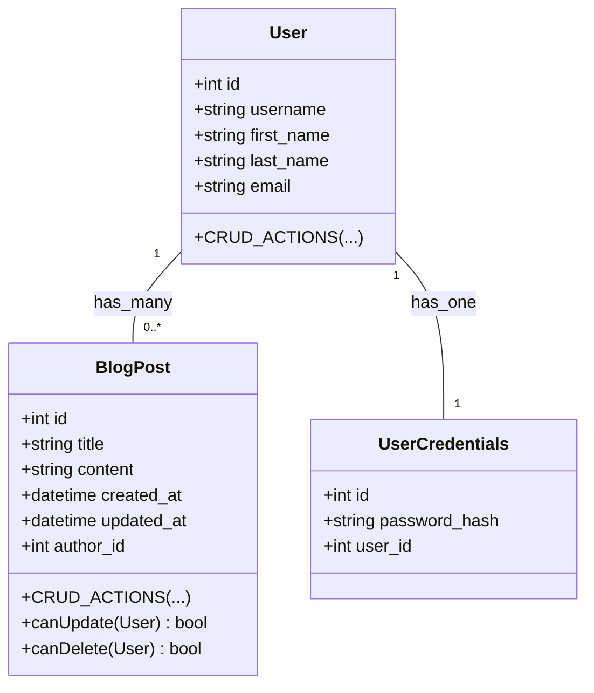

## About this project


## Backend

Tech Stack:
    - Swagger
    - JWT Auth
    - Docker
    - Django NINJA
    - DJango ORM
    - DJango admin
    - pytest
      - (less verbose than unittest tbh)
      - bonus frontend tests
      - tailwind
      - 

- Requirements
  - Django Ninja ( MVC framework)
  - [ ] Readme.md
  - [ ] devX
- Models
  - [x]  Create Databases>UML section
    - [ ]  Models to achieve functionality
      - User → Blog Post
      - User → Authentication (handled by JWT)
      - [ ] Users can register and log in.
      - [ ] Blog posts should include a
        - [ ] View
          - title, content, author (linked to User), and timestamp.
  - User Stories
    - Users can (using JWT or token-based auth):
      - [ ] register
      - [ ] login
    - [ ] User can create Post
    - [ ] USer can edit post
    - [ ] View Posts
    - [ ] 
- Bonus
  - [ ] Cloud Deployment
  - [ ] User Profile Page
    - [x] me endpoint (JWT poc)
  - [ ] Basic Testing
    - [ ] pytest router crud opoerations integration
    - [ ] jest snapshot tests

- API
  - Register USER
  - Login User
    - [x] me endpoint
  - CRUD Blog Posts
  - user profile (bonus)

- Pages
  - [ ] Registration Page
  - [ ] Login Page
  - [ ] User Profile Page (BONUS)
    - [ ] view list of blog posts
    - [ ] wtf????
  - Blog CRUD Page (bonus)

## Dev Setup

### Backend

```sh
poetry install
# to promote the shell to the virt env or poetry run <command>
poetry shell
```

## Urls

https://github.com/TheBranchDriftCatalyst/microblog/tree/master
http://localhost:5100/
http://127.0.0.1:8000/api/docs#/
http://127.0.0.1:8000/admin/
http://localhost:6006/?path=/story/components-catalystheader--default

## Database



### Misc 
- 1 Decompose the Exercise document into Github REPO readme.md
  - This allows two things.
    - 1: creation of a implementation plan, necessary models and technology stack.
    - 2: Better Dev experience for final product with a useful readme.yaml
- Look into unknown tech requirements and understand the scope of what it can handle (orm, api, crud, etc, api docs and best opractices.) i.e., 
  - 2 Create a UML diagram of the database
  - Ideally, generate schema FROM models as well
  - MVP
- 


Possible Questions
- Why two main folders?
  - Can release UI updates separate from the API updates. (or why not serve the react app through the django app)
  - Will have to configure COORS :(